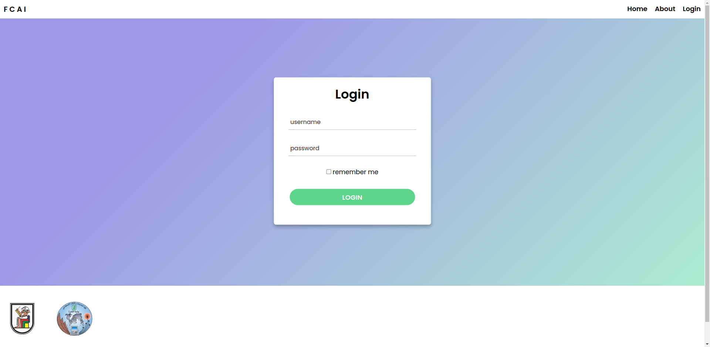
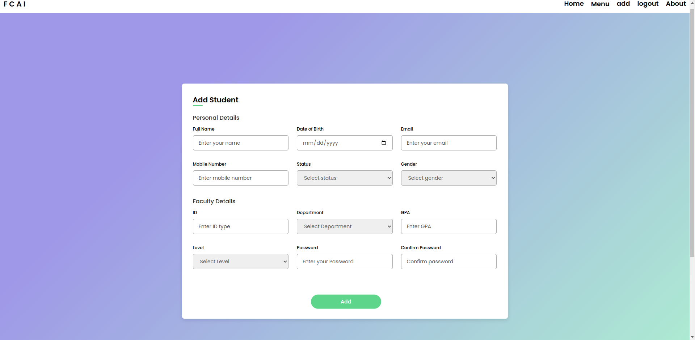
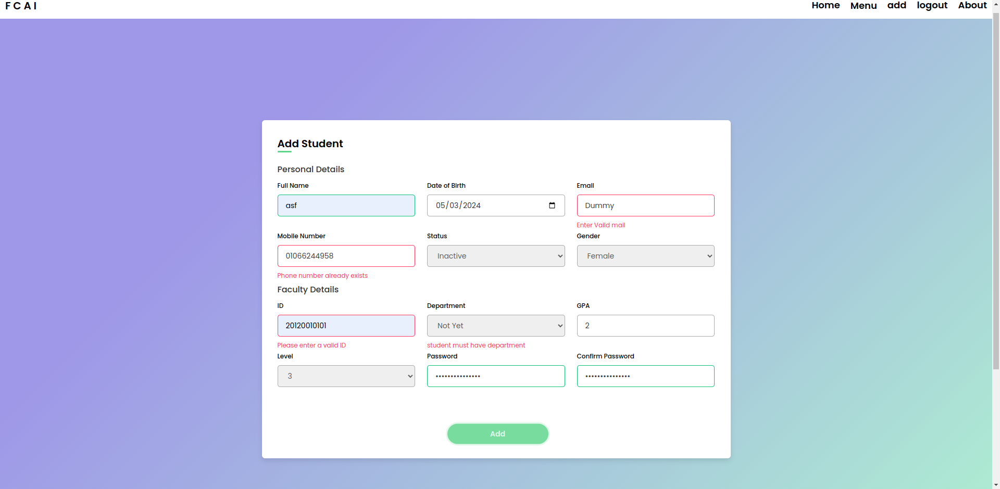
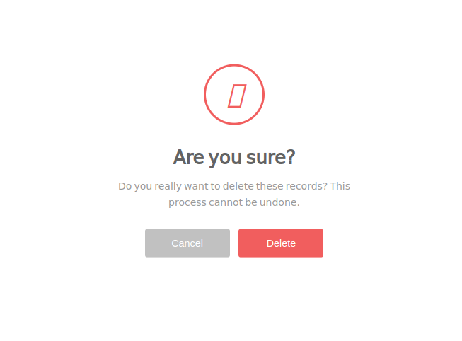
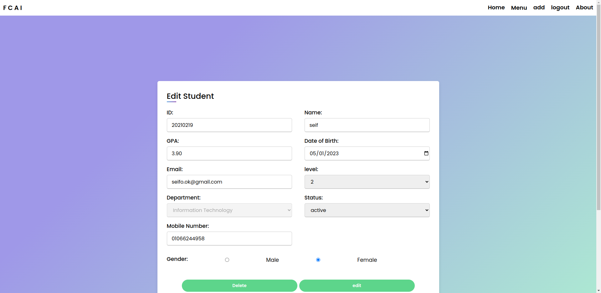
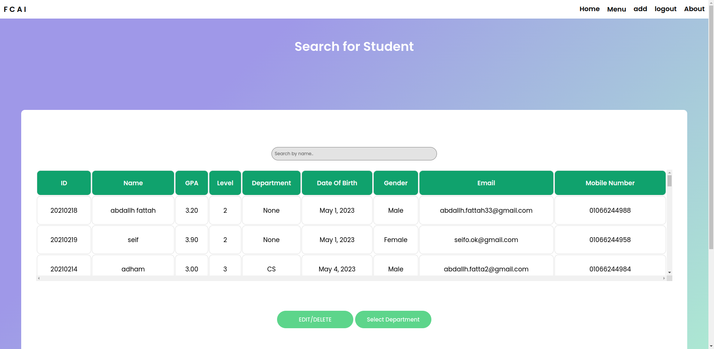
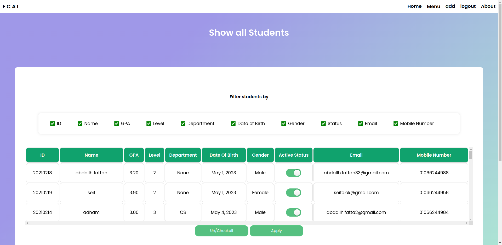

# Django Student Management System

## Overview
This Django project is a Student Management System (SMS) designed to efficiently manage student records for educational institutions. It provides features for department management, student CRUD operations, user authentication, and error handling.

## Features
- Department Management
- Student CRUD Operations
- User Authentication
- Validation and Error Handling

## Models
- Department
- Student
- UserAdmin

## Technologies Used
- Django
- Python
- HTML/CSS/JavaScript

## Dependencies
- Django: `pip install django`
- Whitenoise (for serving static files efficiently): `pip install whitenoise`

## Screenshots
- 
- 
- 
- 
- 
- 
- 

## Populate Script
The `populate.py` script is responsible for creating fake student data and injecting it into the database. It generates random student attributes such as ID, name, GPA, date of birth, gender, email, etc., and assigns them to random departments. This script is useful for populating the database with test data for development and testing purposes.

## note
sadly the main repo had issue with the commits so i had to create a new one